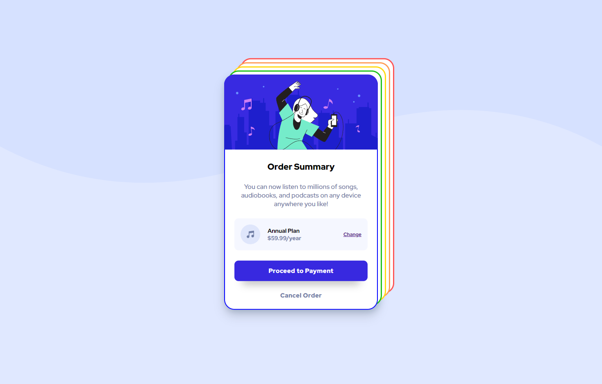

# Frontend Mentor - Order summary card solution

This is a solution to the [Order summary card challenge on Frontend Mentor](https://www.frontendmentor.io/challenges/order-summary-component-QlPmajDUj). Frontend Mentor challenges help you improve your coding skills by building realistic projects. 

## Table of contents

- [Overview](#overview)
  - [The challenge](#the-challenge)
  - [Screenshot](#screenshot)
  - [Links](#links)
- [My process](#my-process)
  - [Built with](#built-with)
  - [What I learned](#what-i-learned)
  - [Continued development](#continued-development)
- [Author](#author)

**Note: Delete this note and update the table of contents based on what sections you keep.**

## Overview

### The challenge

Users should be able to:

- Interact with the buttons on the page.

### Screenshot



### Links

- Solution URL: [https://www.frontendmentor.io/solutions/order-summary-component-WP0kYuycV]
- Live Site URL: [https://jialeee17.github.io/order-summary-component-main/]

## My process

### Built with

- HTML5
- CSS3
- SCSS pre-processor
- JavaScript
- Mobile-first workflow
- RWD Concept

### What I learned

In this challenge, I tried to apply some of the very basic logics using JavaScript to make the website more interactive. For example, the input validation which only allows number as input from users. Also, I wrote a random digits generator for generating order number.

```javascript
    let your_pocket_depth;
    const regex = /\D/gi;

    // Amount validation
    your_pocket_depth = prompt('How much money do you have?');
    if (your_pocket_depth.match(regex)) {
        do {
            window.alert('Please enter valid amount. Don\'t fool me!');
            your_pocket_depth = prompt('How much money do you have?');
        } while (your_pocket_depth.match(regex));
    }
```

```javascript
if (parseInt(your_pocket_depth) > 100) {
        const order_number = Math.floor(100 + Math.random() * 900);
        window.alert(`Your order ${order_number} has been processed!`);
    }
```

### Continued development

I will give it a try to apply more advanced JavaScript logics in the future projects. Stay tuned!

## Author

- GitHub - [jialeee17](https://github.com/jiale456?tab=repositories)
- Frontend Mentor - [jialeee17](https://www.frontendmentor.io/profile/jiale456)

